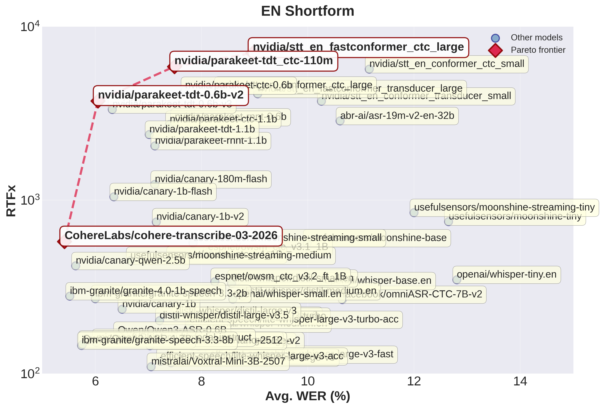
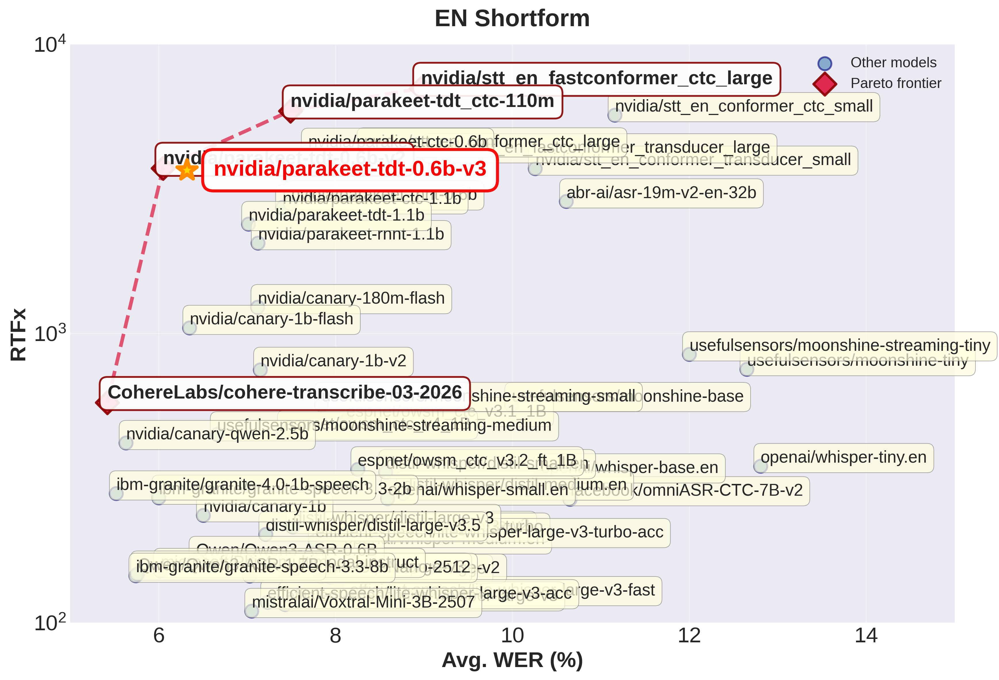
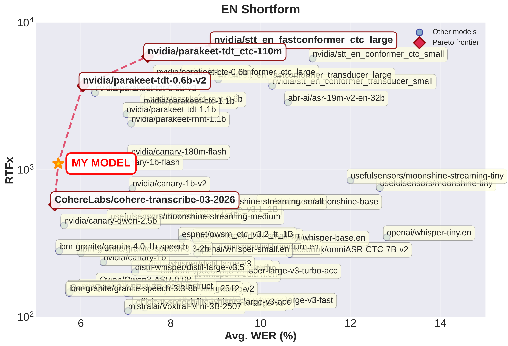

# Open ASR Leaderboard

This repository contains the code for the Open ASR Leaderboard. The leaderboard is a Gradio Space that allows users to compare the accuracy of ASR models on a variety of datasets. The leaderboard is hosted at [hf-audio/open_asr_leaderboard](https://huggingface.co/spaces/hf-audio/open_asr_leaderboard).

# Datasets

The Open ASR Leaderboard evaluates models on a diverse set of publicly available ASR benchmarks hosted on the Hugging Face Hub. These datasets cover a wide range of domains, languages, and recording conditions to provide a fair and comprehensive comparison across models.

* **Core Test Sets (English, sorted, test-only):**
  The main benchmark datasets used for evaluation are available here: [**ESB test-only sorted collection**](https://huggingface.co/datasets/hf-audio/open-asr-leaderboard).

* **Long-form Benchmark (recent addition):**
  The [**ASR Longform benchmark**](https://huggingface.co/datasets/hf-audio/asr-leaderboard-longform) dataset includes earnings21, earnings22, and tedlium. We also evaluate on [CORAAL](https://huggingface.co/datasets/bezzam/coraal), but it is stored as a separate dataset since it has multiple splits.

* **Multilingual Benchmark (recent addition):**
  The [**ASR Multilingual benchmark**](https://huggingface.co/datasets/nithinraok/asr-leaderboard-datasets) dataset includes fleurs, mcv and mls multilingual.

# Requirements

Each library has its own set of requirements. We recommend using a clean conda environment, with Python 3.10 or above.

1) Clone this repository.
2) Install PyTorch by following the instructions here: https://pytorch.org/get-started/locally/
3) Install the common requirements for all library by running `pip install -r requirements/requirements.txt`.
4) Install the requirements for each library you wish to evaluate by running `pip install -r requirements/requirements_<library_name>.txt`.
5) Connect your Hugging Face account by running `huggingface-cli login`.

**Note:** If you wish to run NeMo, the benchmark currently needs CUDA 12.6 to fix a problem in previous drivers for RNN-T inference with cooperative kernels inside conditional nodes (see here: https://github.com/NVIDIA/NeMo/pull/9869). Running `nvidia-smi` should output "CUDA Version: 12.6" or higher.

# Evaluate a model

Each library has a script `run_eval.py` that acts as the entry point for evaluating a model. The script is run by the corresponding bash script for each model that is being evaluated. The script then outputs a JSONL file containing the predictions of the model on each dataset, and summarizes the Word Error Rate (WER) and Inverse Real-Time Factor (RTFx) of the model on each dataset after completion.

**Note**: All evaluations were run using an NVIDIA A100-SXM4-80GB GPU with CUDA 12.6 (or higher) and PyTorch 2.4.0 (or higher). If you are unable to evaluate on such a setup, please request one of the maintainers to run your scripts for evaluation!

## Transformers models (Docker, recommended)

For models supported by the 🤗 Transformers library, we provide a Docker image for reproducible evaluation. From the repository root:

```bash
# Build the image
docker build -t open-asr-transformers -f transformers/Dockerfile .

# Run a specific evaluation script
docker run --rm --gpus all \
    -v $(pwd):/app \
    -v $HF_HOME:/root/.cache/huggingface \
    open-asr-transformers run_whisper.sh
```

See [`transformers/README.md`](./transformers/README.md) for the full list of supported models and detailed Docker usage.

## Other libraries (local setup)

1) Install the common requirements: `pip install -r requirements/requirements.txt`.
2) Check if the library has additional requirements: `pip install -r requirements/requirements_<library_name>.txt` (e.g. `requirements_nemo.txt`, `requirements_espnet.txt`). See the [`requirements/`](./requirements/) folder for the full list.
3) Change directory into the library you wish to evaluate. For example, `cd nemo_asr`.
4) Run the bash script for the model you wish to evaluate. For example, `bash run_parakeet.sh`.


## Trade-off plots

For open-source models, you can plot tradeoff plots like below with `scripts/plot_all.sh`.



You can highlight a particular model (see `scripts/data` for CSV results as of 26 March 2026):
```
./scripts/plot_all.sh --highlight "model_name"

# for example
./scripts/plot_all.sh --highlight "nvidia/parakeet-tdt-0.6b-v3"
```



You can also specify your own model and its performance as such:
```
./scripts/plot_all.sh --custom-model "MY MODEL" --model-size 2.0 --en-shortform-wer 5.5 --en-shortform-rtfx 1000
```



# Contributing

## Add a new model or library

1) Fork this repository and create a new branch.
2) Follow the checklist in the [pull request template](./.github/PULL_REQUEST_TEMPLATE.md) — it covers both **Transformers models** and **non-Transformers libraries**.
3) Key guidelines:
   - Each `run_eval.py` script must use `normalizer/data_utils.py` for data loading, normalization, and manifest writing.
   - Create one bash script per model type (e.g. `run_whisper.sh`). Different sizes of the same model share a script.
   - Use the **same decoding hyper-parameters** across all datasets for a given model.
   - Evaluations must be run on an **A100-SXM4-80GB GPU** with the maximum possible batch size. If you don't have access, ask a maintainer to run your scripts.
4) Submit a PR with your results.

## Template `run_eval.py` script

<details>

<summary> Click to expand </summary>

```python
import argparse
import os
import torch
from transformers import WhisperForConditionalGeneration, WhisperProcessor
import evaluate
from normalizer import data_utils
from tqdm import tqdm

wer_metric = evaluate.load("wer")

def main(args):
    # Load model (FILL ME!)
    model = WhisperForConditionalGeneration.from_pretrained(args.model_id, torch_dtype=torch.bfloat16).to(args.device)
    processor = WhisperProcessor.from_pretrained(args.model_id)

    def benchmark(batch):
        # Load audio inputs
        audios = [audio["array"] for audio in batch["audio"]]
        batch["audio_length_s"] = [len(audio) / batch["audio"][0]["sampling_rate"] for audio in audios]
        minibatch_size = len(audios)

        # Start timing
        torch.cuda.synchronize(device=args.device)
        start_event = torch.cuda.Event(enable_timing=True)
        end_event = torch.cuda.Event(enable_timing=True)
        start_event.record()

        # INFERENCE (FILL ME! Replacing 1-3 with steps from your library)
        # 1. Pre-processing
        inputs = processor(audios, sampling_rate=16_000, return_tensors="pt").to(args.device)
        inputs["input_features"] = inputs["input_features"].to(torch.bfloat16)
        # 2. Generation
        pred_ids = model.generate(**inputs)
        # 3. Post-processing
        pred_text = processor.batch_decode(pred_ids, skip_special_tokens=True)

        # End timing
        end_event.record()
        torch.cuda.synchronize(device=args.device)
        runtime = start_event.elapsed_time(end_event) / 1000.0

        # normalize by minibatch size since we want the per-sample time
        batch["transcription_time_s"] = minibatch_size * [runtime / minibatch_size]

        # normalize transcriptions with English normalizer
        batch["predictions"] = [data_utils.normalizer(pred) for pred in pred_text]
        batch["references"] = batch["norm_text"]
        return batch

    if args.warmup_steps is not None:
        warmup_dataset = data_utils.load_data(args)
        warmup_dataset = data_utils.prepare_data(warmup_dataset)

        num_warmup_samples = args.warmup_steps * args.batch_size
        if args.streaming:
            warmup_dataset = warmup_dataset.take(num_warmup_samples)
        else:
            warmup_dataset = warmup_dataset.select(range(min(num_warmup_samples, len(warmup_dataset))))
        warmup_dataset = iter(warmup_dataset.map(benchmark, batch_size=args.batch_size, batched=True))

        for _ in tqdm(warmup_dataset, desc="Warming up..."):
            continue

    dataset = data_utils.load_data(args)
    dataset = data_utils.prepare_data(dataset)

    if args.max_eval_samples is not None and args.max_eval_samples > 0:
        print(f"Subsampling dataset to first {args.max_eval_samples} samples!")
        if args.streaming:
            dataset = dataset.take(args.max_eval_samples)
        else:
            dataset = dataset.select(range(min(args.max_eval_samples, len(dataset))))

    dataset = dataset.map(
        benchmark, batch_size=args.batch_size, batched=True, remove_columns=["audio"],
    )

    all_results = {
        "audio_length_s": [],
        "transcription_time_s": [],
        "predictions": [],
        "references": [],
    }
    result_iter = iter(dataset)
    for result in tqdm(result_iter, desc="Samples..."):
        for key in all_results:
            all_results[key].append(result[key])

    # Write manifest results (WER and RTFX)
    manifest_path = data_utils.write_manifest(
        all_results["references"],
        all_results["predictions"],
        args.model_id,
        args.dataset_path,
        args.dataset,
        args.split,
        audio_length=all_results["audio_length_s"],
        transcription_time=all_results["transcription_time_s"],
    )
    print("Results saved at path:", os.path.abspath(manifest_path))

    wer = wer_metric.compute(
        references=all_results["references"], predictions=all_results["predictions"]
    )
    wer = round(100 * wer, 2)
    rtfx = round(sum(all_results["audio_length_s"]) / sum(all_results["transcription_time_s"]), 2)
    print("WER:", wer, "%", "RTFx:", rtfx)


if __name__ == "__main__":
    parser = argparse.ArgumentParser()

    parser.add_argument(
        "--model_id",
        type=str,
        required=True,
        help="Model identifier. Should be loadable with 🤗 Transformers",
    )
    parser.add_argument(
        "--dataset_path",
        type=str,
        default="esb/datasets",
        help="Dataset path. By default, it is `esb/datasets`",
    )
    parser.add_argument(
        "--dataset",
        type=str,
        required=True,
        help="Dataset name. *E.g.* `'librispeech_asr` for the LibriSpeech ASR dataset, or `'common_voice'` for Common Voice. The full list of dataset names "
        "can be found at `https://huggingface.co/datasets/esb/datasets`",
    )
    parser.add_argument(
        "--split",
        type=str,
        default="test",
        help="Split of the dataset. *E.g.* `'validation`' for the dev split, or `'test'` for the test split.",
    )
    parser.add_argument(
        "--device",
        type=int,
        default=-1,
        help="The device to run the pipeline on. -1 for CPU (default), 0 for the first GPU and so on.",
    )
    parser.add_argument(
        "--batch_size",
        type=int,
        default=1,
        help="Number of samples to go through each streamed batch.",
    )
    parser.add_argument(
        "--max_eval_samples",
        type=int,
        default=None,
        help="Number of samples to be evaluated. Put a lower number e.g. 64 for testing this script.",
    )
    parser.add_argument(
        "--no-streaming",
        dest="streaming",
        action="store_false",
        help="Choose whether you'd like to download the entire dataset or stream it during the evaluation.",
    )
    parser.add_argument(
        "--warmup_steps",
        type=int,
        default=10,
        help="Number of warm-up steps to run before launching the timed runs.",
    )
    args = parser.parse_args()
    parser.set_defaults(streaming=False)

    main(args)

```

</details>

# Citation 


```bibtex
@misc{srivastav2025openasrleaderboardreproducible,
      title={Open ASR Leaderboard: Towards Reproducible and Transparent Multilingual and Long-Form Speech Recognition Evaluation}, 
      author={Vaibhav Srivastav and Steven Zheng and Eric Bezzam and Eustache Le Bihan and Nithin Koluguri and Piotr Żelasko and Somshubra Majumdar and Adel Moumen and Sanchit Gandhi},
      year={2025},
      eprint={2510.06961},
      archivePrefix={arXiv},
      primaryClass={cs.CL},
      url={https://arxiv.org/abs/2510.06961}, 
}
```
